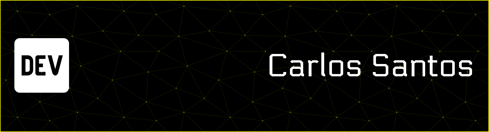

<h2>Olá, atualmente sou estudante de analise e desenvolvimento de sistemas, no instituto federal de Bragança Paulista. ✌️ </h2>

  

  

   

## Habilidades  
<table><tr><td valign="top" width="33%">

### Linguagens  

  
  
  
  
  

</td><td valign="top" width="33%">

### Design e Musica  

  
  
  
  
  

</td></tr></table>  

   

## Connect with me  

  
  

   

## Github Stats  

  

   

----

----

  <h2>Area destinada a projetos futuros</h2>

